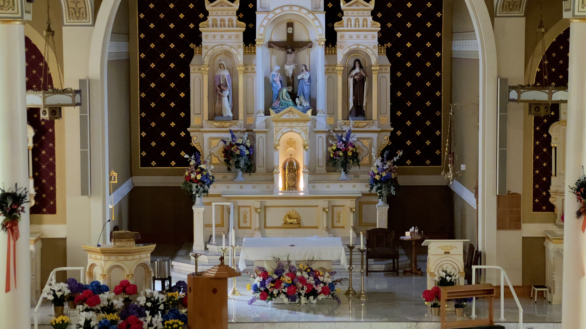

Please don't expect this to be an organized article or elaborate pouring out of my thoughts and emotions. The reasoning behind this post stems from my thoughts and emotions from Easter Vigil Mass at my church this evening, and I wanted to share my thoughts here in a way that I can look back at them years down the line. I don't really have a plan for writing this, but hopefully you can make some sense of it.

"One prayer, one blessing, one hope, one peace, one church, one people, one love released," is the ending of the refrain from the common Catholic hymn One Love Released, written by Bob Frenzel and Kevin Keil. This hymn, and subsequently those lyrics, have always stuck with me each year, specifically the "one church, one people". Easter is one of the few Sundays a year where church attendance is at its highest, and while I am aware of the common phrase used for those who only attend church on Christmas and Easter (CEOs), I still give credit to those who attend church period. In a world that has moved away from faith as much as ours has, even attending once or twice a year is something that can fill your heart in a way nothing else can.

Now, my family and I are pretty consistent with our attendance to Sunday Mass, singing in the choir most Sundays all year round. However, Easter, and Holy Week altogether, is one of those weeks where I think a little more deeply about my faith and what it means to be a "Christian". Bringing another song to light, Hallelujah, the Easter Version, has the following verse, "He looked with fear upon his sword, Then turned to face his Christ and Lord, Fell to his knees crying Hallelujah." Referencing the soldier who struck Jesus in the side, this line shows perfectly just how monumentally emotional his crucifixion was. This man, a man who had done nothing wrong, a man who had healed the sick, helped the poor, and taught lessons to hundreds, was being put to death by the very people he walked with just weeks ago. In the Christmas version of Hallelujah there is the line "My sins would drive the nails in You, that rugged cross was my cross too," that portrays those very same emotions to me. Throughout scripture, worship, and these songs, it is made apparent, it was not some random people who condemned the savior of the world to death, it was me, it was all of us, the very people he came to save. And sure, this was all prophesied years earlier, but still, the death of a perfect man, for the sake of saving the world, is something that hits deep, deeper than any other story, narrative, anything, I have ever heard before.

I will be honest, looking back at my writing here, there is so much more that I wanted to say, and write about, and there are a million other ways I could write this to get some point across, but that isn't my goal. My goal here is just to express my thoughts in some manner, any manner possible. I will likely make another post in the coming days to the tune and expansion of this one, and I hope you tune in to read it, but until then, all I can say is, take some time to pray and think this Easter. It is such a powerful time, and there is so much greatness in this season, greatness that can change you and your life for the better.

(_This is a photo I took just before Mass this evening, and while my phone camera can't do the beauty justice, maybe it can be worth something, to someone._)

-- Ethan
